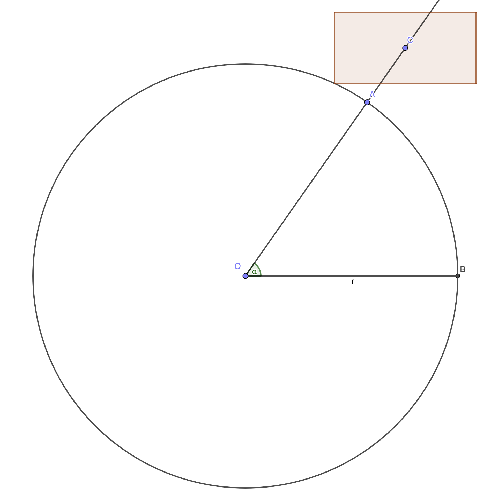

+++
title = "labeled_circle_problem"
date = "2024-09-27"
description = "a hard maths problem"
+++

As per the diagram below, there is a circle centred on $O$ with radius $r$,
and a rectangle with a centre $C$ and width and height of $w$ and $h$ respectively.
$OB$ is parallel to the $x$-axis, and the bottom and top sides of the rectangle must also be parallel to the $x$-axis.

Given any angle $\alpha$, $C$ must lie on the ray $OA$ and the rectangle must intersect the circle at one and only one point.

Find the coordinates of $C$ in terms of $\alpha$, $r$, $w$, $h$, and the coordinates of $O$.

